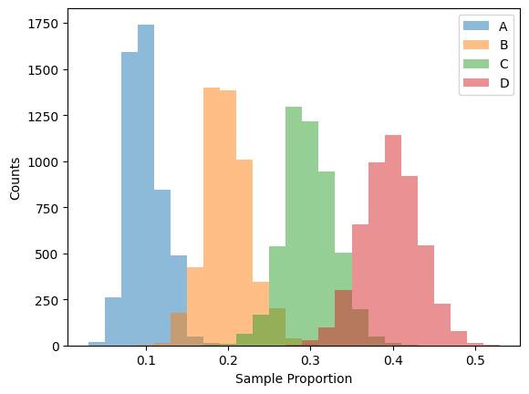
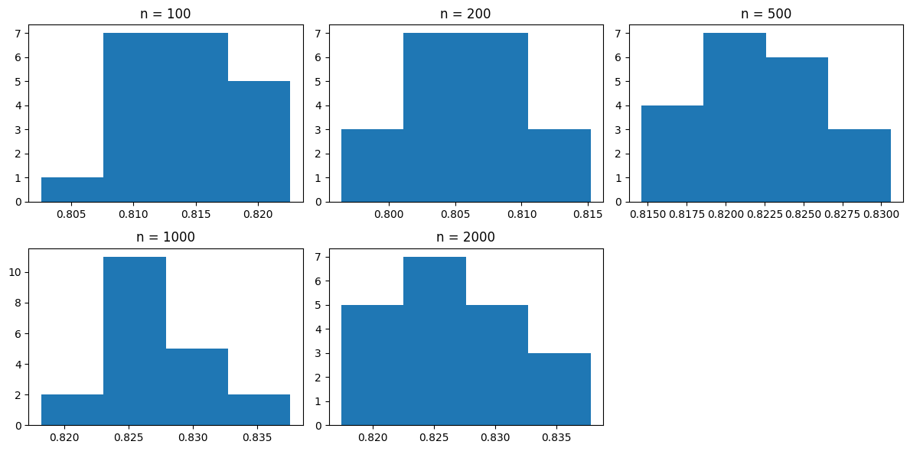
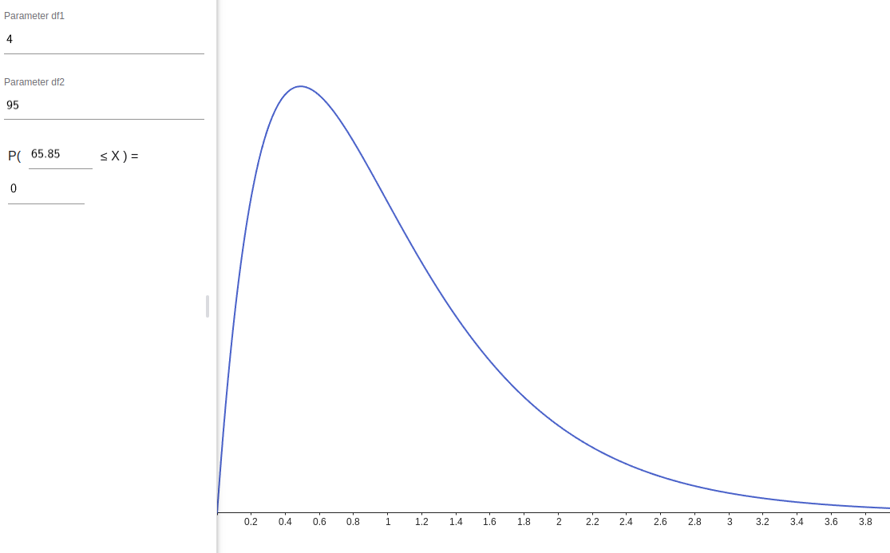

# Confidence Intervals for the Chi-Squared Test for Goodness of Fit

## Background

### What is a $\chi^2$ test?

$\chi^2$ tests are fundamentally based on the $\chi^2$ statistic:

$$
\chi^2 = \sum\frac{(\text{Obs} - \text{Exp})^2}{\text{Exp}}
$$

The P-value is then determined from the $\chi^2$ distribution with a suitable degree of freedom:

$$
P = \int_{\chi^2}^\infty \chi^2_k\text{-pdf}(t)\,dt
$$

<a title="Geek3, CC BY 3.0 &lt;https://creativecommons.org/licenses/by/3.0&gt;, via Wikimedia Commons" href="https://commons.wikimedia.org/wiki/File:Chi-square_pdf.svg"></a>

<a href="https://commons.wikimedia.org/wiki/File:Chi-square_pdf.svg">Geek3</a>, <a href="https://creativecommons.org/licenses/by/3.0">CC BY 3.0</a>, via Wikimedia Commons

If the P-value is less than the significance level $\alpha$, we reject the null hypothesis. At the
fundamental level, the null hypothesis always states that multiple distributions of categories
matches one another (either between a sample and a known population, between two samples, or within
one sample between different values of one variable).

However, because multiple categories are involved, it is not obvious how to construct an equivalent
confidence interval for $\chi^2$ tests. This can be demonstrated by the difficulty in completing the
following statement:

> I am XX% confident that the interval `____` captures `____`.

How can _one_ interval capture variability spread across _multiple_ categories? Should there be an
interval for each category? If that's the case, what does the confidence level even _mean_?

This project attempts to resolve this lack of clarity by deriving a clearly-defined confidence
interval, specifically for the $\chi^2$ test for goodness of fit.

### Why goodness of fit?

This project restricts the scope of the confidence interval to goodness-of-fit (GOF) tests only.
This is because it is the most natural to ask the question "what could the population look like?"
when only one categorical sample is given. For multiple samples/variables, it is much more common to
proceed with the $\chi^2$ _test_ for homogeneity/independence instead.

### Counts and the multinomial distribution

The first assumption to check when performing a $\chi^2$ test is that the data must be counts. But
what are counts, exactly?

```{important}
Counts are the artifacts of a multinomial distribution for a categorical variable.
```

Let us first consider a Bernoulli trial with probability of success $p$. The _binomial_ distribution
gives the expected value and standard deviation as follows:

$$
\begin{align*}
    E(X) &= np \\
    SD(X) &= \sqrt{np(1-p)} \\
\end{align*}
$$

where $X$ is defined as number of successes in $n$ trials.

In the case of counts, there are more than two outcomes. In fact, each category (or "column", in a
typical $\chi^2$ test table) represents one possible outcome. Let $X_i$ be the number of trials that
result in the $i$th outcome over $n$ trials. Then $X_i$ follow the _multinomial_ distribution:

$$
\begin{align*}
    E(X_i) &= np_i \\
    SD(X_i) &= \sqrt{np_i(1-p_i)} \\
\end{align*}
$$

Notice how the two equations are exactly the same as the binomial distribution. Intuitively, this
makes sense, since we can mentally "merge" all categories that is not the $i$th one into one big
category: the "not $i$th" category. In that case, the scenario simplifies to a basic Bernoulli
trial/binomial distribution.

The next example is generated from 5000 random samples of size 200 with the following probability
distribution:

| Category    | A   | B   | C   | D   |
| ----------- | --- | --- | --- | --- |
| Probability | 0.1 | 0.2 | 0.3 | 0.4 |



Notice how each of the four categories follow a binomial (approximately normal) sampling
distribution.

This observation is going to be the eventual foundation of this project.

## An (unsuccessful) simple attempt

In the case of a one-proportion z-test, we can simulate the hypothesis test by creating a confidence
interval from the sample proportion. If the given population proportion falls outside the interval,
then we can conclude that there is evidence that the actual population proportion is different (or
has changed). Specifically, a two-tailed z-test with significance level $\alpha$ corresponds to a
confidence interval with confidence level $(1 - \alpha)$.

<a title="Smahdavi4, CC BY-SA 4.0 &lt;https://creativecommons.org/licenses/by-sa/4.0&gt;, via Wikimedia Commons" href="https://commons.wikimedia.org/wiki/File:Null-hypothesis-region-eng.png"></a>

<a href="https://commons.wikimedia.org/wiki/File:Null-hypothesis-region-eng.png">Smahdavi4</a>, <a href="https://creativecommons.org/licenses/by-sa/4.0">CC BY-SA 4.0</a>, via Wikimedia Commons

```{important}
Could we translate this analogy into the language of $\chi^2$ tests?
```

Our very first obstacle is that the data are discrete counts, not proportions. This is easily fixed
by dividing the counts by the sample size. After that, one potential way to approach this problem is
to define the lower and upper limits of the interval for each category as the population proportion
(for that category) with which it is just barely possible to avoid rejecting the null hypothesis
with the given sample proportions.

However, this approach does not clearly answer the question stated in the first section:

> I am XX% confident that the interval `____` captures `____`.

since it does not guarantee that out of all possible samples of sample size $n$, XX% of the
corresponding confidence intervals would capture the true population proportion. Even if it were to
do so, does every interval for every category capture the population proportion? What is the
relationship across categories, as they're clearly not independent?

If you're interested in further investigating this method, Stan Brown has written an interesting
[article](https://brownmath.com/stat/gof_ci.htm#CIspec2) on it.

## Adapting the one-proportion z-interval to $\chi^2$ GOF tests

Instead of attempting to reuse the relatively unfamiliar $\chi^2$ distribution, let's revert back to
what we already know: the approximately normal sampling distribution created from binomial models.

For example, the following table shows a possible sample distribution as well as the corresponding
95% confidence z-interval for each of the four categories (sample size: 200).

| Category | Proportion | Confidence Interval |
| -------- | ---------- | ------------------- |
| A        | 0.075      | (0.0385, 0.1115)    |
| B        | 0.180      | (0.1268, 0.2332)    |
| C        | 0.370      | (0.3031, 0.4369)    |
| D        | 0.375      | (0.3079, 0.4421)    |

So now we can say,

> I am 95% confident that the confidence interval (0.0385, 0.1115) captures the true population
> proportion for category A.

(and similar statements for the remaining categories)

### Overall confidence level across multiple categories

But what if we want to do more than giving a confidence interval for one category at a time only?
Could we make the following statement:

> I am XX% confident that each of the population proportions across all four categories lies within
> their respective confidence intervals.

We already have the intervals. They are listed in the table above. However, we do not know the
confidence level. 95% is not the answer because that is the confidence level for one category only.
The overall confidence level is certainly lower, since there is additional variance in the "not
$i$th" category we mentioned earlier. The question is: how much lower?

The naive approach would be to multiply the confidence levels together (i.e. $0.95^4$), but that
approach is incorrect because the assumption of independence is not met. In fact, the four sample
proportions strictly abide by the following relationship:

$$
\sum_i \hat{p}_i = \hat{p}_A + \hat{p}_B + \hat{p}_C + \hat{p}_D = 1
$$

It is a nontrivial task to utilize this relationship to mathematically determine how the
variabilities for the four sample proportions affect one another. This project makes use of a
computer-based simulation to experimentally determine the overall confidence level.

## The simulation

- Simulation: The simulation consists of combinations of the following sample sizes and population
  proportions:

  - sample sizes $n$
    - 50
    - 100
    - 200
    - 500
    - 1000
    - 2000
  - population proportions $p_i$ where $1 \le i \le m$ and $m$ is the number of categories
    - 0.3, 0.7
    - 0.1, 0.3, 0.6
    - 0.2, 0.3, 0.5
    - 0.25, 0.35, 0.4
    - $\frac{1}{3}$, $\frac{1}{3}$, $\frac{1}{3}$
    - 0.1, 0.2, 0.3, 0.4
    - 0.15, 0.25, 0.3, 0.3
    - 0.25, 0.25, 0.25, 0.25
    - 0.1, 0.1, 0.1, 0.1, 0.6
    - 0.15, 0.15, 0.15, 0.15, 0.4
    - 0.2, 0.2, 0.2, 0.2, 0.2

  Combinations for which the success/failure condition ($np \ge 10$) isn't met are excluded from the
  simulation.

- Component: drawing a sample with sample size $n$ and population proportions $p_i$
- Outcome: The sample proportions are calculated by dividing counts by $n$. One-proportion
  z-intervals at 95% confidence level are computed from each sample proportion. The number of
  categories for which the true population proportion falls within the confidence interval is
  determined.
- Trials: 5000 trials are performed.
- Response: The proportions of samples for which $k\;(k \in \mathbb{Z}\cap [0, m])$ categories
  generate confidence intervals that capture their corresponding population proportions are
  recorded.

### Simulation results

A total of 20 simulations was performed for each combination of $n$ and $p_i$. The following table
displays the mean and standard deviation of the 20 trials for $n = 100$ and
$p_i = \text{[0.15, 0.25, 0.3, 0.3]}$.

| $n$ | $p_i$                  | $k$         | 0                    | 1                    | 2                    | 3                    | 4                    |
| --- | ---------------------- | ----------- | -------------------- | -------------------- | -------------------- | -------------------- | -------------------- |
| 100 | [0.15, 0.25, 0.3, 0.3] | $\bar{x}_k$ | 0.00002              | 0.00143              | 0.0304               | 0.1543               | 0.81385              |
|     |                        | $s_k$       | $6.2 \times 10^{-5}$ | $5.8 \times 10^{-4}$ | $2.5 \times 10^{-3}$ | $5.0 \times 10^{-3}$ | $5.0 \times 10^{-3}$ |

```{tip}
Full simulation results are available in [Appendix A](#appendix-a-full-simulation-results).
```

Observe how it is different from the binomial distribution $\mathrm{Binom}(n = 4, p = 0.95, k)$
where independence between different trials (i.e. categories, in this scenario) is assumed.

| $k$ | 0       | 1       | 2       | 3       | 4       |
| --- | ------- | ------- | ------- | ------- | ------- |
| $p$ | 0.00001 | 0.00047 | 0.01354 | 0.17147 | 0.81451 |

Now consider two other combinations of $n$ and $p_i$:

| $n$ | $p_i$                  | $k = 0$ | 1       | 2       | 3       | 4       |
| --- | ---------------------- | ------- | ------- | ------- | ------- | ------- |
| 500 | [0.15, 0.25, 0.3, 0.3] | 0.00012 | 0.00076 | 0.03316 | 0.14449 | 0.82147 |
| 100 | [0.1, 0.2, 0.3, 0.4]   | 0.00002 | 0.00175 | 0.03398 | 0.15838 | 0.80587 |

In the first row, $n$ changed from 100 to 200. In the second row, $n$ stayed the same, while $p_i$
changed from [0.15, 0.25, 0.3, 0.3] to [0.1, 0.2, 0.3, 0.4]. For both rows, there are subtle changes
in the mean for each value of $k$. Are these differences significant?

Answering this question sounds exactly like the job of a hypothesis test.

```{important}
What type of test should be used?

- Even though the data are proportions, the response variable itself (i.e. the confidence level
  we're interested in, say, 82% or 0.82) can be considered quantitative in nature.
- We ran each simulation 20 times, and we have means and standard deviations.
- There are multiple ($> 2$) samples.

It seems that we need a variant of the two-mean t-test that generalizes to multiple means.
```

### Performing a one-way ANOVA test

One-way ANOVA tests detect differences between multiple means. ANOVA stands for ANalysis Of
VAriance, and the test produces an F-statistic that is equal to the ratio of the variance _between_
samples to the variance _within_ the samples.

The P-value can then be calculated from using the F-distribution, which has two degree-of-freedom
parameters.

<a title="IkamusumeFan, CC BY-SA 4.0 &lt;https://creativecommons.org/licenses/by-sa/4.0&gt;, via Wikimedia Commons" href="https://commons.wikimedia.org/wiki/File:F-distribution_pdf.svg"></a>

<a href="https://commons.wikimedia.org/wiki/File:F-distribution_pdf.svg">IkamusumeFan</a>, <a href="https://creativecommons.org/licenses/by-sa/4.0">CC BY-SA 4.0</a>, via Wikimedia Commons

#### Hypotheses

- $H_0:$ The true population means of the overall confidence level that corresponds to a
  one-proportion z-interval at 95% confidence for each category of the multinomial distribution with
  $p_i = [0.15, 0.25, 0.3, 0.3]$ are the same across different values of $n$.
- $H_a:$ At least one of the aforementioned population means is different from the others.

#### Assumptions and conditions

- Independence: The data is generated using a pseudorandom generator with different seeds for each
  sample.
- Population nearly normal: Histograms of sample distributions are nearly normal.

  

- Equal Variance: Sample standard deviations across different values of $n$ are approximately equal.

  | $n$  | $s$                  |
  | ---- | -------------------- |
  | 100  | $5.0 \times 10^{-3}$ |
  | 200  | $5.1 \times 10^{-3}$ |
  | 500  | $4.7 \times 10^{-3}$ |
  | 1000 | $4.7 \times 10^{-3}$ |
  | 2000 | $5.7 \times 10^{-3}$ |

Ok to perform a one-way ANOVA test at $\mathrm{df1} = 4$, $\mathrm{df2} = 95$, and $\alpha = 0.05$

#### F-statistic and P-value

The `scipy` stats package gives

$$
\begin{align*}
  F &= 65.845 \\
  P &= 1.5 \times 10^{-26} \ll \alpha \\
\end{align*}
$$



#### Conclusion

The P-value is low, so I reject the null hypothesis. There is strong evidence that at least one of
the true population means (across different values of $n$) of the overall confidence level that
corresponds to a one-proportion z-interval at 95% confidence for each category of the multinomial
distribution with $p_i = [0.15, 0.25, 0.3, 0.3]$ is different from the others.

Similar tests are performed for other values of $p_i$. A second set of one-way ANOVA tests are
performed for each value of $n$ across different values of $p_i$. The null hypotheses are _rejected_
in these tests.

```{tip}
Please refer to [Appendix B](#appendix-b-full-anova-test-results) for the full ANOVA test results.
```

```{caution}
The tests are also performed for each value of $k$, i.e. the number of categories that generate
confidence intervals that capture their corresponding population proportions. However, when $k$ is
small, assumptions for the one-way ANOVA test may be violated. Caution is required when interpreting
these results.
```

## Converting between individual and overall confidence levels

Based on the previous section, we can conclude that the overall confidence level depends both on the
sample size $n$ and the population proportions $p_i$. So how can we make use of this information to
make a general statement
[about all categories](#overall-confidence-level-across-multiple-categories)?

If we are given a random sample, we already know the sample size. Obviously, we don't know the
population proportions, but we can reuse the same technique when we first studied confidence
intervals: just pretend that the sample proportions _are_ the population proportions! That's how we
came up with $SE(\hat{p})$, right?

In other words, if we're given a sample of size $n$ and sample proportions $\hat{p}_i$, we can
temporarily assume that $p_i = \hat{p}_i$ and rerun the simulation described in the previous
section. The resulting proportion corresponding to $k = m$ (reminder: $m$ is the total number of
categories) is therefore the overall confidence level across all categories.

Note that this procedure requires that we predetermine a confidence level for any individual
category (i.e. the confidence level used in a one-proportion z-interval). What if we want to specify
the overall confidence level instead?

In other words, if we want to make the following statement:

> I am 90% confident that each of the population proportions across all four categories lies within
> their respective confidence intervals.

What confidence level should these "respective confidence intervals" (one-proportion z-intervals)
use?

This problem can be solved by using a binary search for the individual confidence level. For
example, if the target overall confidence level is 90%, let's first assume that the corresponding
individual confidence level is, say, 96%. Then we run the simulation and see if the resulting
overall confidence level is less than or greater than the target value of 90%. After that, we can
adjust our guess (96%) accordingly.

By repeating the procedure above, we are able to reach a close estimate of the true individual
confidence level.

A Python implementation of this confidence-level conversion process can be found
[here](https://github.com/acciochris/stats-project-2025/blob/main/chi_squared_conf_int_demo.ipynb).

<a target="_blank" href="https://colab.research.google.com/github/acciochris/stats-project-2025/blob/main/chi_squared_conf_int_demo.ipynb">
  
</a>

## Conclusion

In this project, we investigated the multinomial distribution behind a $\chi^2$ goodness-of-fit
test. We executed a simulation to adapt the one-proportion z-interval to $\chi^2$ GOF tests. We
performed one-way ANOVA tests to determine whether the sample size and/or the population proportions
had an impact on overall confidence level. Finally, we established a procedure of converting between
individual and overall confidence levels.

This project allows us to confidently (hahaha) create confidence intervals for each of the
categories of a multinomial distribution, and more importantly, to compute and interpret a
confidence level that encapsulates the random variability across all categories.

## Appendix A: Full simulation results

| $n$  | $p_i$                                         | $k = 0$ | 1       | 2       | 3       | 4      | 5      |
| ---- | --------------------------------------------- | ------- | ------- | ------- | ------- | ------ | ------ |
| 50   | [0.2, 0.2, 0.2, 0.2, 0.2]                     | 1e-05   | 7e-05   | 0.0038  | 0.03902 | 0.2204 | 0.7367 |
| 50   | [0.2, 0.3, 0.5]                               | 0.00059 | 0.03973 | 0.1104  | 0.8493  |        |        |
| 50   | [0.25, 0.25, 0.25, 0.25]                      | 4e-05   | 0.00186 | 0.0285  | 0.1731  | 0.7965 |        |
| 50   | [0.25, 0.35, 0.4]                             | 0.00036 | 0.03306 | 0.1069  | 0.8597  |        |        |
| 50   | [0.3, 0.7]                                    | 0.0673  | 0       | 0.9327  |         |        |        |
| 50   | [$\frac{1}{3}$, $\frac{1}{3}$, $\frac{1}{3}$] | 0.00013 | 0.02843 | 0.09476 | 0.8767  |        |        |
| 100  | [0.1, 0.1, 0.1, 0.1, 0.6]                     | 0       | 0.00026 | 0.00627 | 0.03904 | 0.2258 | 0.7287 |
| 100  | [0.1, 0.2, 0.3, 0.4]                          | 2e-05   | 0.00175 | 0.03398 | 0.1584  | 0.8059 |        |
| 100  | [0.1, 0.3, 0.6]                               | 0.00078 | 0.03131 | 0.09957 | 0.8683  |        |        |
| 100  | [0.15, 0.15, 0.15, 0.15, 0.4]                 | 1e-05   | 0.0001  | 0.00484 | 0.04107 | 0.2247 | 0.7293 |
| 100  | [0.15, 0.25, 0.3, 0.3]                        | 2e-05   | 0.00143 | 0.0304  | 0.1543  | 0.8139 |        |
| 100  | [0.2, 0.2, 0.2, 0.2, 0.2]                     | 0       | 0.00019 | 0.00444 | 0.04926 | 0.2222 | 0.7239 |
| 100  | [0.2, 0.3, 0.5]                               | 0.00035 | 0.034   | 0.1058  | 0.8598  |        |        |
| 100  | [0.25, 0.25, 0.25, 0.25]                      | 4e-05   | 0.00105 | 0.02945 | 0.1547  | 0.8148 |        |
| 100  | [0.25, 0.35, 0.4]                             | 8e-05   | 0.03067 | 0.1017  | 0.8676  |        |        |
| 100  | [0.3, 0.7]                                    | 0.05031 | 0       | 0.9497  |         |        |        |
| 100  | [$\frac{1}{3}$, $\frac{1}{3}$, $\frac{1}{3}$] | 4e-05   | 0.02322 | 0.08881 | 0.8879  |        |        |
| 200  | [0.1, 0.1, 0.1, 0.1, 0.6]                     | 1e-05   | 0.00028 | 0.00649 | 0.04583 | 0.2288 | 0.7185 |
| 200  | [0.1, 0.2, 0.3, 0.4]                          | 2e-05   | 0.00169 | 0.0353  | 0.1631  | 0.7999 |        |
| 200  | [0.1, 0.3, 0.6]                               | 0.00105 | 0.03524 | 0.1064  | 0.8573  |        |        |
| 200  | [0.15, 0.15, 0.15, 0.15, 0.4]                 | 1e-05   | 6e-05   | 0.00264 | 0.0371  | 0.1909 | 0.7692 |
| 200  | [0.15, 0.25, 0.3, 0.3]                        | 3e-05   | 0.00124 | 0.03437 | 0.1585  | 0.8059 |        |
| 200  | [0.2, 0.2, 0.2, 0.2, 0.2]                     | 1e-05   | 0.00013 | 0.00287 | 0.03777 | 0.2069 | 0.7523 |
| 200  | [0.2, 0.3, 0.5]                               | 0.00025 | 0.03216 | 0.1042  | 0.8634  |        |        |
| 200  | [0.25, 0.25, 0.25, 0.25]                      | 0.00014 | 0.0014  | 0.03941 | 0.1673  | 0.7917 |        |
| 200  | [0.25, 0.35, 0.4]                             | 0.00011 | 0.03248 | 0.1043  | 0.8631  |        |        |
| 200  | [0.3, 0.7]                                    | 0.05589 | 0       | 0.9441  |         |        |        |
| 200  | [$\frac{1}{3}$, $\frac{1}{3}$, $\frac{1}{3}$] | 0.00014 | 0.02821 | 0.1001  | 0.8715  |        |        |
| 500  | [0.1, 0.1, 0.1, 0.1, 0.6]                     | 0       | 0.0001  | 0.00367 | 0.03981 | 0.1896 | 0.7668 |
| 500  | [0.1, 0.2, 0.3, 0.4]                          | 1e-05   | 0.00124 | 0.03231 | 0.1414  | 0.825  |        |
| 500  | [0.1, 0.3, 0.6]                               | 0.00043 | 0.03229 | 0.09169 | 0.8756  |        |        |
| 500  | [0.15, 0.15, 0.15, 0.15, 0.4]                 | 1e-05   | 0.00016 | 0.00235 | 0.03734 | 0.1785 | 0.7816 |
| 500  | [0.15, 0.25, 0.3, 0.3]                        | 0.00012 | 0.00076 | 0.03316 | 0.1445  | 0.8215 |        |
| 500  | [0.2, 0.2, 0.2, 0.2, 0.2]                     | 0       | 9e-05   | 0.00164 | 0.03661 | 0.1763 | 0.7854 |
| 500  | [0.2, 0.3, 0.5]                               | 0.00017 | 0.03067 | 0.09411 | 0.8751  |        |        |
| 500  | [0.25, 0.25, 0.25, 0.25]                      | 7e-05   | 0.00091 | 0.03624 | 0.1527  | 0.8101 |        |
| 500  | [0.25, 0.35, 0.4]                             | 6e-05   | 0.02889 | 0.09887 | 0.8722  |        |        |
| 500  | [0.3, 0.7]                                    | 0.05092 | 0       | 0.9491  |         |        |        |
| 500  | [$\frac{1}{3}$, $\frac{1}{3}$, $\frac{1}{3}$] | 1e-05   | 0.0305  | 0.09667 | 0.8728  |        |        |
| 1000 | [0.1, 0.1, 0.1, 0.1, 0.6]                     | 0       | 9e-05   | 0.00246 | 0.03406 | 0.1663 | 0.7971 |
| 1000 | [0.1, 0.2, 0.3, 0.4]                          | 3e-05   | 0.00098 | 0.03199 | 0.1371  | 0.8299 |        |
| 1000 | [0.1, 0.3, 0.6]                               | 0.00025 | 0.03123 | 0.08415 | 0.8844  |        |        |
| 1000 | [0.15, 0.15, 0.15, 0.15, 0.4]                 | 0       | 0.00014 | 0.00225 | 0.03803 | 0.1835 | 0.7761 |
| 1000 | [0.15, 0.25, 0.3, 0.3]                        | 5e-05   | 0.00066 | 0.03197 | 0.14    | 0.8274 |        |
| 1000 | [0.2, 0.2, 0.2, 0.2, 0.2]                     | 0       | 0.00019 | 0.00179 | 0.0389  | 0.1828 | 0.7763 |
| 1000 | [0.2, 0.3, 0.5]                               | 0.00016 | 0.03062 | 0.0957  | 0.8735  |        |        |
| 1000 | [0.25, 0.25, 0.25, 0.25]                      | 6e-05   | 0.0006  | 0.03329 | 0.1461  | 0.8199 |        |
| 1000 | [0.25, 0.35, 0.4]                             | 7e-05   | 0.02991 | 0.09679 | 0.8732  |        |        |
| 1000 | [0.3, 0.7]                                    | 0.04903 | 0       | 0.951   |         |        |        |
| 1000 | [$\frac{1}{3}$, $\frac{1}{3}$, $\frac{1}{3}$] | 4e-05   | 0.02625 | 0.09076 | 0.8829  |        |        |
| 2000 | [0.1, 0.1, 0.1, 0.1, 0.6]                     | 1e-05   | 0.00015 | 0.00328 | 0.03826 | 0.1796 | 0.7787 |
| 2000 | [0.1, 0.2, 0.3, 0.4]                          | 2e-05   | 0.00093 | 0.0312  | 0.1396  | 0.8282 |        |
| 2000 | [0.1, 0.3, 0.6]                               | 0.00041 | 0.03335 | 0.08903 | 0.8772  |        |        |
| 2000 | [0.15, 0.15, 0.15, 0.15, 0.4]                 | 1e-05   | 0.00015 | 0.00203 | 0.03743 | 0.1814 | 0.779  |
| 2000 | [0.15, 0.25, 0.3, 0.3]                        | 2e-05   | 0.00072 | 0.03255 | 0.1399  | 0.8269 |        |
| 2000 | [0.2, 0.2, 0.2, 0.2, 0.2]                     | 0       | 0.00017 | 0.0017  | 0.037   | 0.178  | 0.7831 |
| 2000 | [0.2, 0.3, 0.5]                               | 0.00015 | 0.02877 | 0.09528 | 0.8758  |        |        |
| 2000 | [0.25, 0.25, 0.25, 0.25]                      | 0.00011 | 0.00061 | 0.03239 | 0.145   | 0.8219 |        |
| 2000 | [0.25, 0.35, 0.4]                             | 6e-05   | 0.02817 | 0.09321 | 0.8786  |        |        |
| 2000 | [0.3, 0.7]                                    | 0.05047 | 0       | 0.9495  |         |        |        |
| 2000 | [$\frac{1}{3}$, $\frac{1}{3}$, $\frac{1}{3}$] | 7e-05   | 0.0278  | 0.09806 | 0.8741  |        |        |

| $n$  | $p_i$                                         | $k = 0$   | 1         | 2         | 3        | 4        | 5        |
| ---- | --------------------------------------------- | --------- | --------- | --------- | -------- | -------- | -------- |
| 50   | [0.2, 0.2, 0.2, 0.2, 0.2]                     | 4.472e-05 | 0.0001174 | 0.001114  | 0.001677 | 0.004869 | 0.004965 |
| 50   | [0.2, 0.3, 0.5]                               | 0.0002469 | 0.002966  | 0.005519  | 0.006237 |          |          |
| 50   | [0.25, 0.25, 0.25, 0.25]                      | 8.208e-05 | 0.0006524 | 0.001837  | 0.005336 | 0.005783 |          |
| 50   | [0.25, 0.35, 0.4]                             | 0.000201  | 0.002136  | 0.003811  | 0.004924 |          |          |
| 50   | [0.3, 0.7]                                    | 0.003095  | 0         | 0.003095  |          |          |          |
| 50   | [$\frac{1}{3}$, $\frac{1}{3}$, $\frac{1}{3}$] | 0.0001342 | 0.002093  | 0.004222  | 0.004812 |          |          |
| 100  | [0.1, 0.1, 0.1, 0.1, 0.6]                     | 0         | 0.0001847 | 0.0009825 | 0.00301  | 0.004722 | 0.005744 |
| 100  | [0.1, 0.2, 0.3, 0.4]                          | 6.156e-05 | 0.0007104 | 0.003224  | 0.005613 | 0.006659 |          |
| 100  | [0.1, 0.3, 0.6]                               | 0.0003778 | 0.002558  | 0.004149  | 0.004752 |          |          |
| 100  | [0.15, 0.15, 0.15, 0.15, 0.4]                 | 4.472e-05 | 0.0001654 | 0.0007937 | 0.003357 | 0.006717 | 0.00614  |
| 100  | [0.15, 0.25, 0.3, 0.3]                        | 6.156e-05 | 0.0005777 | 0.002503  | 0.005012 | 0.005019 |          |
| 100  | [0.2, 0.2, 0.2, 0.2, 0.2]                     | 0         | 0.0001651 | 0.0008375 | 0.002285 | 0.00394  | 0.003973 |
| 100  | [0.2, 0.3, 0.5]                               | 0.0002236 | 0.00175   | 0.005543  | 0.005165 |          |          |
| 100  | [0.25, 0.25, 0.25, 0.25]                      | 8.208e-05 | 0.0004807 | 0.001973  | 0.004973 | 0.004863 |          |
| 100  | [0.25, 0.35, 0.4]                             | 0.0001005 | 0.002463  | 0.004322  | 0.005227 |          |          |
| 100  | [0.3, 0.7]                                    | 0.002522  | 0         | 0.002522  |          |          |          |
| 100  | [$\frac{1}{3}$, $\frac{1}{3}$, $\frac{1}{3}$] | 8.208e-05 | 0.002137  | 0.004574  | 0.005125 |          |          |
| 200  | [0.1, 0.1, 0.1, 0.1, 0.6]                     | 4.472e-05 | 0.0002285 | 0.001329  | 0.002614 | 0.005923 | 0.006105 |
| 200  | [0.1, 0.2, 0.3, 0.4]                          | 6.156e-05 | 0.000788  | 0.003207  | 0.005785 | 0.006398 |          |
| 200  | [0.1, 0.3, 0.6]                               | 0.0003103 | 0.002492  | 0.004847  | 0.005532 |          |          |
| 200  | [0.15, 0.15, 0.15, 0.15, 0.4]                 | 4.472e-05 | 9.403e-05 | 0.0006855 | 0.002834 | 0.005291 | 0.006083 |
| 200  | [0.15, 0.25, 0.3, 0.3]                        | 7.327e-05 | 0.0003705 | 0.002561  | 0.004643 | 0.005143 |          |
| 200  | [0.2, 0.2, 0.2, 0.2, 0.2]                     | 4.472e-05 | 0.0001625 | 0.0007767 | 0.002302 | 0.005942 | 0.006568 |
| 200  | [0.2, 0.3, 0.5]                               | 0.0002236 | 0.00254   | 0.003515  | 0.003984 |          |          |
| 200  | [0.25, 0.25, 0.25, 0.25]                      | 0.0001465 | 0.0006358 | 0.00318   | 0.005248 | 0.005454 |          |
| 200  | [0.25, 0.35, 0.4]                             | 0.000121  | 0.001857  | 0.004097  | 0.003811 |          |          |
| 200  | [0.3, 0.7]                                    | 0.002599  | 0         | 0.002599  |          |          |          |
| 200  | [$\frac{1}{3}$, $\frac{1}{3}$, $\frac{1}{3}$] | 0.0001603 | 0.002422  | 0.005318  | 0.005824 |          |          |
| 500  | [0.1, 0.1, 0.1, 0.1, 0.6]                     | 0         | 0.0001214 | 0.0009782 | 0.002535 | 0.003902 | 0.004516 |
| 500  | [0.1, 0.2, 0.3, 0.4]                          | 4.472e-05 | 0.0005335 | 0.002277  | 0.005515 | 0.005739 |          |
| 500  | [0.1, 0.3, 0.6]                               | 0.0002179 | 0.001736  | 0.005173  | 0.005372 |          |          |
| 500  | [0.15, 0.15, 0.15, 0.15, 0.4]                 | 4.472e-05 | 0.0001536 | 0.0008457 | 0.002234 | 0.00505  | 0.005098 |
| 500  | [0.15, 0.25, 0.3, 0.3]                        | 0.0001508 | 0.0003016 | 0.002471  | 0.004079 | 0.004686 |          |
| 500  | [0.2, 0.2, 0.2, 0.2, 0.2]                     | 0         | 0.0001373 | 0.0006636 | 0.002471 | 0.007213 | 0.007644 |
| 500  | [0.2, 0.3, 0.5]                               | 0.0001625 | 0.002638  | 0.004529  | 0.004641 |          |          |
| 500  | [0.25, 0.25, 0.25, 0.25]                      | 0.0001174 | 0.0004564 | 0.002482  | 0.005682 | 0.004796 |          |
| 500  | [0.25, 0.35, 0.4]                             | 9.403e-05 | 0.001542  | 0.003913  | 0.004057 |          |          |
| 500  | [0.3, 0.7]                                    | 0.002424  | 0         | 0.002424  |          |          |          |
| 500  | [$\frac{1}{3}$, $\frac{1}{3}$, $\frac{1}{3}$] | 4.472e-05 | 0.002093  | 0.004628  | 0.005638 |          |          |
| 1000 | [0.1, 0.1, 0.1, 0.1, 0.6]                     | 0         | 0.000121  | 0.0006589 | 0.001899 | 0.006254 | 0.005838 |
| 1000 | [0.1, 0.2, 0.3, 0.4]                          | 7.327e-05 | 0.0004396 | 0.001997  | 0.006037 | 0.005956 |          |
| 1000 | [0.1, 0.3, 0.6]                               | 0.0002236 | 0.002591  | 0.004201  | 0.00462  |          |          |
| 1000 | [0.15, 0.15, 0.15, 0.15, 0.4]                 | 0         | 0.0001957 | 0.0007015 | 0.003165 | 0.004343 | 0.004244 |
| 1000 | [0.15, 0.25, 0.3, 0.3]                        | 8.885e-05 | 0.0003619 | 0.002626  | 0.004584 | 0.004668 |          |
| 1000 | [0.2, 0.2, 0.2, 0.2, 0.2]                     | 0         | 0.00021   | 0.0006973 | 0.002645 | 0.005072 | 0.004926 |
| 1000 | [0.2, 0.3, 0.5]                               | 0.0001789 | 0.002666  | 0.004127  | 0.005031 |          |          |
| 1000 | [0.25, 0.25, 0.25, 0.25]                      | 0.0001142 | 0.0003554 | 0.002571  | 0.005882 | 0.005955 |          |
| 1000 | [0.25, 0.35, 0.4]                             | 9.787e-05 | 0.002482  | 0.004317  | 0.005576 |          |          |
| 1000 | [0.3, 0.7]                                    | 0.002381  | 0         | 0.002381  |          |          |          |
| 1000 | [$\frac{1}{3}$, $\frac{1}{3}$, $\frac{1}{3}$] | 0.0001046 | 0.002361  | 0.004158  | 0.004199 |          |          |
| 2000 | [0.1, 0.1, 0.1, 0.1, 0.6]                     | 4.472e-05 | 0.0002417 | 0.001004  | 0.002584 | 0.005203 | 0.006214 |
| 2000 | [0.1, 0.2, 0.3, 0.4]                          | 6.156e-05 | 0.0004601 | 0.001785  | 0.007363 | 0.007378 |          |
| 2000 | [0.1, 0.3, 0.6]                               | 0.0002936 | 0.003295  | 0.004425  | 0.005209 |          |          |
| 2000 | [0.15, 0.15, 0.15, 0.15, 0.4]                 | 4.472e-05 | 0.0001701 | 0.0006689 | 0.002727 | 0.00641  | 0.005586 |
| 2000 | [0.15, 0.25, 0.3, 0.3]                        | 6.156e-05 | 0.0003071 | 0.002536  | 0.006051 | 0.00566  |          |
| 2000 | [0.2, 0.2, 0.2, 0.2, 0.2]                     | 0         | 0.0002179 | 0.0006308 | 0.002828 | 0.006652 | 0.006575 |
| 2000 | [0.2, 0.3, 0.5]                               | 0.0002328 | 0.002497  | 0.004365  | 0.004656 |          |          |
| 2000 | [0.25, 0.25, 0.25, 0.25]                      | 0.0001373 | 0.0003076 | 0.001785  | 0.004795 | 0.005171 |          |
| 2000 | [0.25, 0.35, 0.4]                             | 0.0001142 | 0.002132  | 0.004306  | 0.005106 |          |          |
| 2000 | [0.3, 0.7]                                    | 0.003421  | 0         | 0.003421  |          |          |          |
| 2000 | [$\frac{1}{3}$, $\frac{1}{3}$, $\frac{1}{3}$] | 0.0001342 | 0.002582  | 0.004185  | 0.004475 |          |          |

## Appendix B: Full ANOVA test results

| $p_i$                                         | $k = 0$ | 1     | 2     | 3     | 4     | 5     |
| --------------------------------------------- | ------- | ----- | ----- | ----- | ----- | ----- |
| [0.1, 0.1, 0.1, 0.1, 0.6]                     | 0.75    | 4.555 | 65.34 | 54.79 | 565.5 | 681.8 |
| [0.1, 0.2, 0.3, 0.4]                          | 0.2669  | 8.207 | 8.306 | 76.33 | 92.54 |       |
| [0.1, 0.3, 0.6]                               | 24.9    | 8.35  | 74.32 | 80.46 |       |       |
| [0.15, 0.15, 0.15, 0.15, 0.4]                 | 0.25    | 1.354 | 47.94 | 6.472 | 226.5 | 311.5 |
| [0.15, 0.25, 0.3, 0.3]                        | 4.062   | 15.46 | 6.686 | 60.06 | 65.85 |       |
| [0.2, 0.2, 0.2, 0.2, 0.2]                     | 0.8     | 1.808 | 44.75 | 78.78 | 276.9 | 383.4 |
| [0.2, 0.3, 0.5]                               | 12.75   | 46.79 | 42.38 | 89.34 |       |       |
| [0.25, 0.25, 0.25, 0.25]                      | 2.421   | 19.19 | 60.92 | 91.28 | 107.8 |       |
| [0.25, 0.35, 0.4]                             | 17.12   | 16.67 | 29.45 | 41.66 |       |       |
| [0.3, 0.7]                                    | 125.8   |       | 125.8 |       |       |       |
| [$\frac{1}{3}$, $\frac{1}{3}$, $\frac{1}{3}$] | 4.095   | 23.12 | 18.44 | 32.74 |       |       |

| $p_i$                                         | $k = 0$   | 1         | 2         | 3         | 4         | 5         |
| --------------------------------------------- | --------- | --------- | --------- | --------- | --------- | --------- |
| [0.1, 0.1, 0.1, 0.1, 0.6]                     | 0.5604    | 0.002077  | 1.909e-26 | 7.245e-24 | 2.646e-65 | 5.113e-69 |
| [0.1, 0.2, 0.3, 0.4]                          | 0.8986    | 9.953e-06 | 8.653e-06 | 7.922e-29 | 6.588e-32 |           |
| [0.1, 0.3, 0.6]                               | 4.065e-14 | 8.137e-06 | 2.066e-28 | 1.172e-29 |           |           |
| [0.15, 0.15, 0.15, 0.15, 0.4]                 | 0.909     | 0.2559    | 5.298e-22 | 0.0001193 | 1.151e-47 | 1.1e-53   |
| [0.15, 0.25, 0.3, 0.3]                        | 0.004395  | 8.957e-10 | 8.739e-05 | 3.405e-25 | 1.465e-26 |           |
| [0.2, 0.2, 0.2, 0.2, 0.2]                     | 0.5519    | 0.1168    | 2.38e-25  | 2.373e-35 | 5.081e-62 | 1.545e-69 |
| [0.2, 0.3, 0.5]                               | 7.654e-10 | 4.452e-26 | 1.773e-24 | 8.829e-38 |           |           |
| [0.25, 0.25, 0.25, 0.25]                      | 0.03986   | 8.148e-14 | 1.324e-30 | 3.343e-38 | 1.574e-41 |           |
| [0.25, 0.35, 0.4]                             | 1.323e-12 | 2.472e-12 | 4.296e-19 | 3.313e-24 |           |           |
| [0.3, 0.7]                                    | 1.05e-44  |           | 1.05e-44  |           |           |           |
| [$\frac{1}{3}$, $\frac{1}{3}$, $\frac{1}{3}$] | 0.001863  | 5.715e-16 | 2.193e-13 | 1.404e-20 |           |           |

| $n$  | $m$ | $k = 0$   | 1       | 2     | 3     | 4     | 5     |
| ---- | --- | --------- | ------- | ----- | ----- | ----- | ----- |
| 50   | 3   | 26.59     | 109.2   | 64.1  | 132.8 |       |       |
| 100  | 3   | 44.31     | 84.29   | 48.11 | 111.6 |       |       |
| 100  | 4   | 0.5588    | 6.889   | 16.66 | 3.73  | 15.4  |       |
| 100  | 5   | 1         | 4.35    | 24.18 | 68.74 | 2.469 | 5.9   |
| 200  | 3   | 85.17     | 30.47   | 6.78  | 28.7  |       |       |
| 200  | 4   | 8.684     | 2.686   | 16.01 | 14.24 | 31.2  |       |
| 200  | 5   | 3.444e-33 | 8.665   | 98.54 | 70.24 | 220.9 | 340.7 |
| 500  | 3   | 33.13     | 9.235   | 9.227 | 2.244 |       |       |
| 500  | 4   | 4.724     | 6.196   | 14.7  | 25.45 | 46.56 |       |
| 500  | 5   | 1         | 1.505   | 30.14 | 9.629 | 32.93 | 55.16 |
| 1000 | 3   | 7.023     | 15.63   | 37.66 | 29.87 |       |       |
| 1000 | 4   | 0.532     | 5.558   | 1.962 | 13.94 | 17.47 |       |
| 1000 | 5   |           | 1.546   | 4.989 | 19.37 | 68.17 | 114.6 |
| 2000 | 3   | 12.45     | 18.85   | 15.5  | 3.122 |       |       |
| 2000 | 4   | 6.131     | 3.959   | 2.55  | 4.841 | 5.858 |       |
| 2000 | 5   | 0.5       | 0.05933 | 22.49 | 1.113 | 1.565 | 3.247 |

| $n$  | $m$ | $k = 0$   | 1         | 2         | 3         | 4         | 5         |
| ---- | --- | --------- | --------- | --------- | --------- | --------- | --------- |
| 50   | 3   | 6.959e-09 | 3.217e-20 | 2.601e-15 | 3.534e-22 |           |           |
| 100  | 3   | 1.152e-16 | 4.119e-24 | 1.557e-17 | 9.056e-28 |           |           |
| 100  | 4   | 0.575     | 0.002091  | 2.006e-06 | 0.03004   | 4.486e-06 |           |
| 100  | 5   | 0.3742    | 0.01745   | 2.488e-08 | 6.456e-16 | 0.09371   | 0.004688  |
| 200  | 3   | 3.047e-24 | 4.857e-13 | 0.0004118 | 1.632e-12 |           |           |
| 200  | 4   | 0.0005105 | 0.07679   | 3.029e-06 | 9.624e-06 | 7.055e-10 |           |
| 200  | 5   | 1         | 0.0005177 | 3.166e-19 | 4.175e-16 | 1.411e-27 | 1.98e-32  |
| 500  | 3   | 8.437e-14 | 2.786e-05 | 2.811e-05 | 0.08992   |           |           |
| 500  | 4   | 0.01264   | 0.003673  | 7.108e-06 | 1.262e-08 | 1.031e-12 |           |
| 500  | 5   | 0.3742    | 0.2308    | 1.174e-09 | 0.0002497 | 3.119e-10 | 4.694e-14 |
| 1000 | 3   | 0.0003132 | 5.198e-08 | 5.085e-15 | 7.299e-13 |           |           |
| 1000 | 4   | 0.5903    | 0.006235  | 0.1499    | 1.177e-05 | 1.208e-06 |           |
| 1000 | 5   |           | 0.222     | 0.01008   | 3.807e-07 | 7.635e-16 | 1.057e-20 |
| 2000 | 3   | 1.043e-06 | 3.076e-09 | 5.863e-08 | 0.03081   |           |           |
| 2000 | 4   | 0.003874  | 0.02455   | 0.08697   | 0.01143   | 0.004855  |           |
| 2000 | 5   | 0.6092    | 0.9425    | 6.314e-08 | 0.3356    | 0.218     | 0.04619   |

---

_This article is licensed under [CC BY-SA 4.0](https://creativecommons.org/licenses/by-sa/4.0/)._
