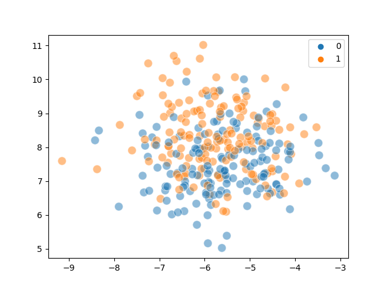
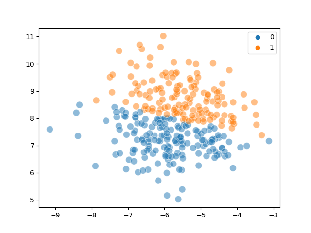
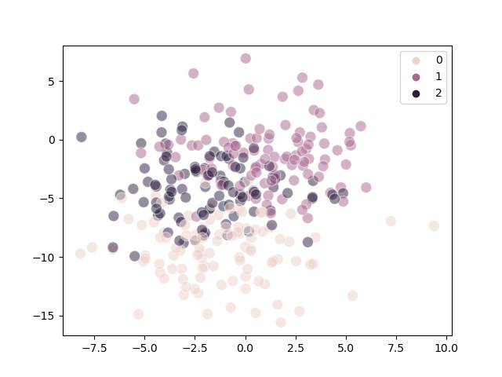
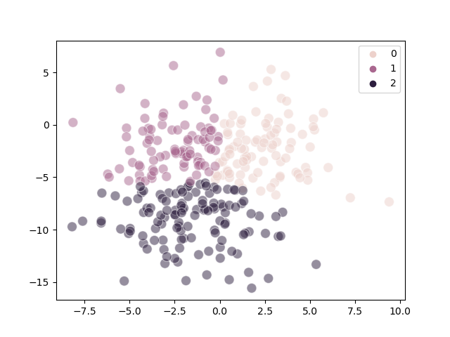
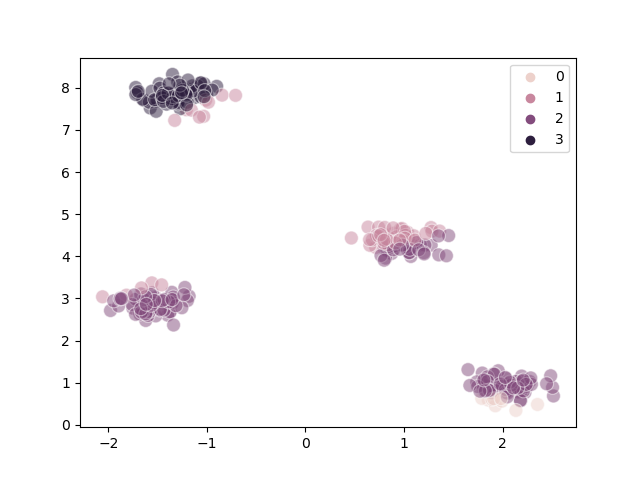
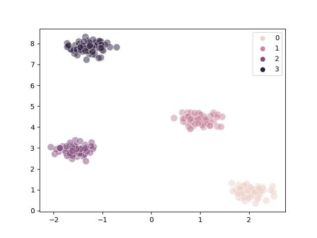
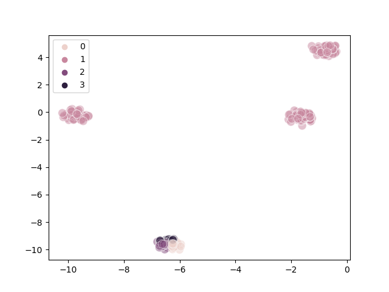

# K-Means clustering: Implmentation and Analysis

After reading about the section K-Means Clustering in [the book](https://github.com/rasbt/machine-learning-book),
I decided to implement naive (vanilla) K-Means clustering by myself.

Here's what I did. (some details omitted for brevity, you can find my full implementation as a
[Jupyter Notebook on Kaggle](https://www.kaggle.com/code/acciochris/kmeans-clustering))

```{code-block} python
:linenos:

def kmeans(
    X,
    centers: int,
    *,
    tolerance: float,
    max_iter: int,
    random_state: int | None = None,
):
    rng = np.random.default_rng(random_state)
    centroids = rng.choice(X, size=centers, replace=False)

    for n in range(max_iter):
        # Determine the closest centroid for each data point
        closest_centroid = np.array(
            [np.argmin([np.linalg.norm(x - c) for c in centroids]) for x in X]
        )

        # Update the centroids
        new_centroids = [
            np.mean(X[closest_centroid == i], axis=0) for i in range(centers)
        ]

        # Loop until we are done
        if np.allclose(centroids, new_centroids, atol=tolerance):
            break

        centroids = new_centroids

    return closest_centroid, centroids
```

However, today's focus is not on how I implemented the algorithm, as my code above is mostly (hopefully)
self-explanatory, but on the analysis of the execution results. In case you are unfamiliar with the algorithm,
you can find a Wikipedia article on K-Means [here](https://en.wikipedia.org/wiki/K-means_clustering).

## Analysis

In total, I ran the K-Means algorithm on generated data with 2, 3, 4 and 5 clusters, and a `cluster_std`
of 0.2, 1.0, 1.8 and 2.6 (determines how diffuse the generated points are). For each of the combinations,
I configured a `random_state` of 0 through 19, so as to avoid the effect of randomness on the results.

### General Performance

The following table shows the performance of the algorithm on each of the configurations

| # of clusters <br /> `cluster_std` |  2  |    3     |    4     |    5    |
| :--------------------------------: | :-: | :------: | :------: | :-----: |
|                0.2                 |  A  | B(0.35)  |  B(0.4)  |    C    |
|                1.0                 | A-  |  B(0.2)  | B(0.25)  | B(0.45) |
|                1.8                 | A-  | B-(0.15) | B-(0.15) |   B-    |
|                2.6                 | A-  |    B-    |    B-    |   B-    |

```{note}
- grades
  - A: excellent
  - B: good (error rate less than 0.5)
  - C: poor
- annotations
  - "-": has [overlap problem](#overlap)
  - "(error_rate)": estimated error rate  shown in parentheses
```

We can infer from the plot that:

1. As the number of clusters increases, the performance of K-Means generally goes down
   
   *Possible explanation*: K-Means rely on random selection of initial centroids. The more clusters,
   the less likely the centroids are evenly distributed among the actual clusters.
2. As `cluster_std` increases, the error rate goes down
   
   *Possible explanation*: It becomes easier for the centroid to jump between clusters as `cluster_std`
   increases. (See section [Steps](#steps))
3. As `cluster_std` increases, the [problem of overlap](#overlap) becomes more significant
   
   *Possible explanation*: High `cluster_std` makes it easy for clusters to overlap with each other.

### Overlap

When clusters become too close to each other, they overlap. This makes it extremely hard for clustering
algorithms to separate the clusters. (The same problem exists for supervised classification)

The following diagrams demonstrate the overlap problem:

|                        Actual                         |                    Predicted                     |
| :---------------------------------------------------: | :----------------------------------------------: |
|  |  |
|  |  |

### Steps

We can visualize the individual steps the K-Means algorithms made during the clustering process.

The following is a well-clustered example:
| Steps |                         Diagram                          |
| :---: | :------------------------------------------------------: |
|   1   |  |
|   2   |  |
|   3   |  |

The following is a poorly-clustered example:

| Steps |                          Diagram                          |
| :---: | :-------------------------------------------------------: |
|   1   |  |
|   2   |  |
|   3   |  |

We can infer from the diagrams that:

1. Poor clustering probably results from poor initial choice of centroids
2. The algorithm converges quite quickly

### Empty cluster

It is possible that empty clusters will appear during the algorithm (as stated in the book), and
I indeed got a warning for that:

```
/opt/conda/lib/python3.10/site-packages/numpy/core/fromnumeric.py:3432: RuntimeWarning: Mean of empty slice.
  return _methods._mean(a, axis=axis, dtype=dtype,
/opt/conda/lib/python3.10/site-packages/numpy/core/_methods.py:182: RuntimeWarning: invalid value encountered in divide
  ret = um.true_divide(
```

### Afternote

There are three `main()` functions in the [notebook](https://www.kaggle.com/code/acciochris/kmeans-clustering).
You can select from them to generate the diagrams in this blog post. What each of them does is implementation
detail and will not be explained in this post.

## Conclusion

The K-Means algorithm is an incredibly efficient algorithm and can perform clustering tasks
with great accuracy as long as the initial centroids and number of clusters are well-chosen.

<script src="https://giscus.app/client.js"
        data-repo="acciochris/acciochris.github.io"
        data-repo-id="R_kgDOKDyTVg"
        data-category="Announcements"
        data-category-id="DIC_kwDOKDyTVs4CYZPy"
        data-mapping="pathname"
        data-strict="0"
        data-reactions-enabled="1"
        data-emit-metadata="0"
        data-input-position="top"
        data-theme="preferred_color_scheme"
        data-lang="en"
        data-loading="lazy"
        crossorigin="anonymous"
        async>
</script>
