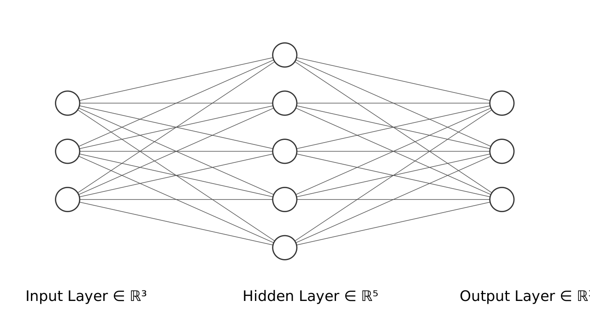

# Matrix Calculus Demystified

Despite having been a machine learning practitioner for a considerable period of time, I have never
truly dived into the mathematical details of deep neural networks, until this morning. This morning
I went over a paper [^1] on matrix calculus and discovered that the maths of deep learning isn't so
challenging after all! (Well, so long as you understand the *basics* of calculus and linear algebra).

## Jacobians

Consider the derivative of a function $y = f(x)$:

$$
\frac{dy}{dx} = \frac{df(x)}{dx} = f'(x)
$$

If we make $f(x)$ output a vector instead ($\mathbf{y} = \mathbf{f}(x)$), then:

$$
\frac{\partial\mathbf{y}}{\partial x} = \begin{bmatrix}
    f'_1(x) \\
    f'_2(x) \\
    \vdots \\
    f'_m(x) \\
\end{bmatrix}
$$

If $x$ is instead a vector ($y = f(\mathbf{x})$), then

$$
\newcommand{\pop}[2]{\dfrac{\partial #1}{\partial #2}}
\newcommand{\V}[1]{\mathbf{#1}}
\pop{y}{\mathbf{x}} = \nabla y = \begin{bmatrix}
    \pop{}{x_1}f(\V{x}) & \pop{}{x_2}f(\V{x}) & \cdots & \pop{}{x_n}f(\V{x})
\end{bmatrix}
$$

Combine the two and we get:

$$
\newcommand{\pop}[2]{\dfrac{\partial #1}{\partial #2}}
\newcommand{\V}[1]{\mathbf{#1}}
\pop{\V{y}}{\V{x}} = \begin{bmatrix}
    \pop{}{x_1}f_1(\V{x}) & \cdots & \pop{}{x_n}f_1(\V{x}) \\
    \vdots  & \ddots & \vdots \\
    \pop{}{x_1}f_m(\V{x}) & \cdots & \pop{}{x_n}f_m(\V{x}) \\
\end{bmatrix}
$$

which is the Jacobian.

## The chain rule

One of the most delightful aspects of matrix calculus is that the chain rule works perfectly well
as in Calculus I:

$$
\newcommand{\pop}[2]{\dfrac{\partial #1}{\partial #2}}
\newcommand{\V}[1]{\mathbf{#1}}
\pop{}{\V{x}}\V{f}(\V{g}(\V{x})) = \pop{\V{f}}{\V{g}}\pop{\V{g}}{\V{x}}
$$

## An example

Let's consider a simple neural network:



Assuming the input data are stored in matrix $\mathbf{X}$ (shape $n \times 3$, $n$ is the number of samples), then

$$
\newcommand{\pop}[2]{\dfrac{\partial #1}{\partial #2}}
\newcommand{\V}[1]{\mathbf{#1}}
\begin{align*}
    \V{Z}_{h} &= \V{X}\V{W}_h^T + \V{b}_h \\
    (n \times 5 &= (n \times 3)@(5 \times 3)^T + [n\times]5) \\
    \V{A}_h &= \text{activation}(\V{Z}_h) \\
    (n \times 5 &= n \times 5) \\
    \V{Z}_{out} &= \V{A}_h\V{W}_{out}^T + \V{b}_{out} \\
    (n \times 3 &= (n \times 5)@(3 \times 5)^T + [n \times] 3) \\
    \V{A}_{out} &= \text{activation}(\V{Z}_{out}) \\
    (n \times 3 &= n \times 3) \\
\end{align*}
$$

Assuming the lost function is MSE:

$$
L = \frac{1}{3n}\sum_i^n\sum_j^3(\mathbf{A}_{out_{ij}} - \mathbf{Y}_{ij})^2
$$

and the activation function is $\tanh x$, we can work out the derivatives for the weights and biases:

$$
\newcommand{\pop}[2]{\dfrac{\partial #1}{\partial #2}}
\newcommand{\V}[1]{\mathbf{#1}}
\begin{align*}
    \pop{L}{\V{W}_{out}} &= \pop{L}{\V{A}_{out}}\pop{\V{A}_{out}}{\V{Z}_{out}}\pop{\V{Z}_{out}}{\V{W}_{out}} \\
    \pop{L}{\V{b}_{out}} &= \pop{L}{\V{A}_{out}}\pop{\V{A}_{out}}{\V{Z}_{out}}\pop{\V{Z}_{out}}{\V{b}_{out}} \\
    \pop{L}{\V{W}_{h}} &= \pop{L}{\V{A}_{out}}\pop{\V{A}_{out}}{\V{Z}_{out}}\pop{\V{Z}_{out}}{\V{A}_h}\pop{\V{A}_h}{\V{Z}_h}\pop{\V{Z}_h}{\V{W}_h} \\
    \pop{L}{\V{b}_{h}} &= \pop{L}{\V{A}_{out}}\pop{\V{A}_{out}}{\V{Z}_{out}}\pop{\V{Z}_{out}}{\V{A}_h}\pop{\V{A}_h}{\V{Z}_h}\pop{\V{Z}_h}{\V{b}_h} \\
\end{align*}
$$

(which is a *ton* of partial derivatives)

Howver, we got into some trouble: by considering a minibatch input, many of our partial derivatives
have matrices both in their numerators and their denominators, which is problematic.

The solution: we extend the Jacobian matrices into higher orders: tensors.

## Tensor Calculus

```{attention}
Ahem. There does seem to be some special points about tensor calculus that I have overlooked. After
experimenting with PyTorch tensors for a while, I figured out that the `jacobian` function isn't
giving results I expected. So perhaps I will stick to vector and matrix calculus for now. 😅
```

However, if we switch back to vectors, most of the above partial derivatives will be easily representable
by ordinary, scalar derivatives.

Consider the following example:

$$
\newcommand{\pop}[2]{\dfrac{\partial #1}{\partial #2}}
\newcommand{\V}[1]{\mathbf{#1}}
\begin{align*}
  \pop{L}{\V{b}_{h}} &= \pop{L}{\V{a}_{out}}\pop{\V{a}_{out}}{\V{z}_{out}}\pop{\V{z}_{out}}{\V{a}_h}\pop{\V{a}_h}{\V{z}_h}\pop{\V{z}_h}{\V{b}_h} \\
  (1 \times 5) &= (1 \times 3)@(3 \times 3)@(3 \times 5)@(5 \times 5)@(5 \times 5)
\end{align*}
$$

The six partial derivatives involved can be expressed as follows:

$$
\newcommand{\pop}[2]{\dfrac{\partial #1}{\partial #2}}
\newcommand{\V}[1]{\mathbf{#1}}
\newcommand{\sechsq}[0]{\text{sech}^2\,}
\begin{align}
  \pop{L}{\V{b}_h} &= \begin{bmatrix}
    \pop{L}{b_{h_1}} & \pop{L}{b_{h_2}} & \pop{L}{b_{h_3}} & \pop{L}{b_{h_4}} & \pop{L}{b_{h_5}} \\
  \end{bmatrix} \\
  \pop{L}{\V{a}_{out}} &= \begin{bmatrix}
    \dfrac{2}{3}(a_{out_1}-y_1) & \dfrac{2}{3}(a_{out_2}-y_2) & \dfrac{2}{3}(a_{out_3}-y_3) \\
  \end{bmatrix} \\
  \pop{\V{a}_{out}}{\V{z}_{out}} &= \text{diag}(\sechsq z_{out_1},\;\sechsq z_{out_2},\;\sechsq z_{out_3},) \\
  \pop{\V{z}_{out}}{\V{a}_h} &= \V{W}_{out} \\
  \pop{\V{a}_h}{\V{z}_h} &= \text{diag}(\sechsq z_{h_1},\;\sechsq z_{h_2},\;\sechsq z_{h_3},\;\sechsq z_{h_4},\;\sechsq z_{h_5}) \\
  \pop{\V{z}_h}{\V{b}_h} &= \V{I}
\end{align}
$$

And it all works out.

<!--
Let's go over the partial derivatives one by one:

- $\dfrac{\partial L}{\partial\mathbf{A}_{out}}(3 \times n)$:
  
  This is in fact still a part of matrix calculus:

  $$
  \newcommand{\pop}[2]{\dfrac{\partial #1}{\partial #2}}
  \newcommand{\V}[1]{\mathbf{#1}}
  \pop{L}{\V{A}_{out}} = \begin{bmatrix}
    \pop{L}{A_{out_{11}}} & \cdots & \pop{L}{A_{out_{n1}}} \\
    \vdots & \ddots & \vdots \\
    \pop{L}{A_{out_{13}}} & \cdots & \pop{L}{A_{out_{n3}}}
  \end{bmatrix}
  $$
- $\dfrac{\partial\mathbf{A}_{out}}{\partial\mathbf{Z}_{out}}$:
  
  Consider vectors:

  $$
  \newcommand{\pop}[2]{\dfrac{\partial #1}{\partial #2}}
  \newcommand{\V}[1]{\mathbf{#1}}
  \pop{\V{a}_{out}}{\V{z}_{out}} = \text{diag}(\text{sech}^2\;z_{out_{i}})
  $$

  In the case of matrices, let's get a bit of help from PyTorch autograd:

  ```python
  import torch
  from torch.autograd.functional import jacobian

  a = torch.ones(2, 3)
  def times_2(x):
      return x * 2

  print(jacobian(times_2, a))
  ```

  Output:

  ```
  tensor([[[[2., 0., 0.],
            [0., 0., 0.]],
  
           [[0., 2., 0.],
            [0., 0., 0.]],
  
           [[0., 0., 2.],
            [0., 0., 0.]]],
  
  
          [[[0., 0., 0.],
            [2., 0., 0.]],
  
           [[0., 0., 0.],
            [0., 2., 0.]],
  
           [[0., 0., 0.],
            [0., 0., 2.]]]])
  ```

  which is of shape $2 \times 3 \times 2 \times 3$
-->

[^1]: Parr, T., & Howard, J. (2018). The matrix calculus you need for deep learning. arXiv preprint arXiv:1802.01528.

<script src="https://giscus.app/client.js"
        data-repo="acciochris/acciochris.github.io"
        data-repo-id="R_kgDOKDyTVg"
        data-category="Announcements"
        data-category-id="DIC_kwDOKDyTVs4CYZPy"
        data-mapping="pathname"
        data-strict="0"
        data-reactions-enabled="1"
        data-emit-metadata="0"
        data-input-position="bottom"
        data-theme="preferred_color_scheme"
        data-lang="en"
        data-loading="lazy"
        crossorigin="anonymous"
        async>
</script>
