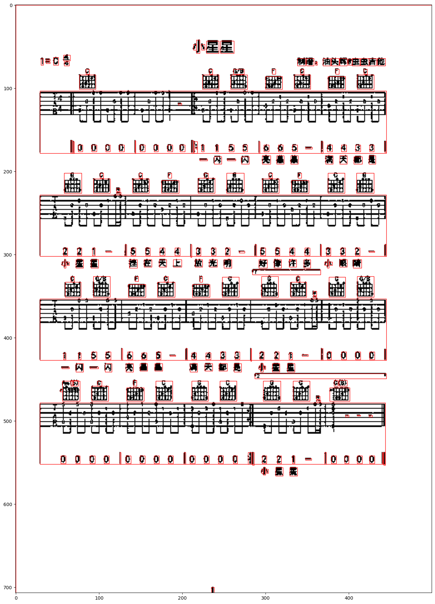

# Numbered Musical Notation Dataset -- Component Extraction 1

How to detect objects (extract components)? This is a crucial problem when I'm trying to extract
musical notation from typesetted images of numbered musical notation sheet music.

My first attempt:

As the sheet music is typesetted, it is relatively easy to use opencv to extract components purely by
analyzing connected components. However, this is less ideal when the image resolution is relatively low.

I'm planning to try RCNNs (a deep learning model for object detection) as an alternative solution.

