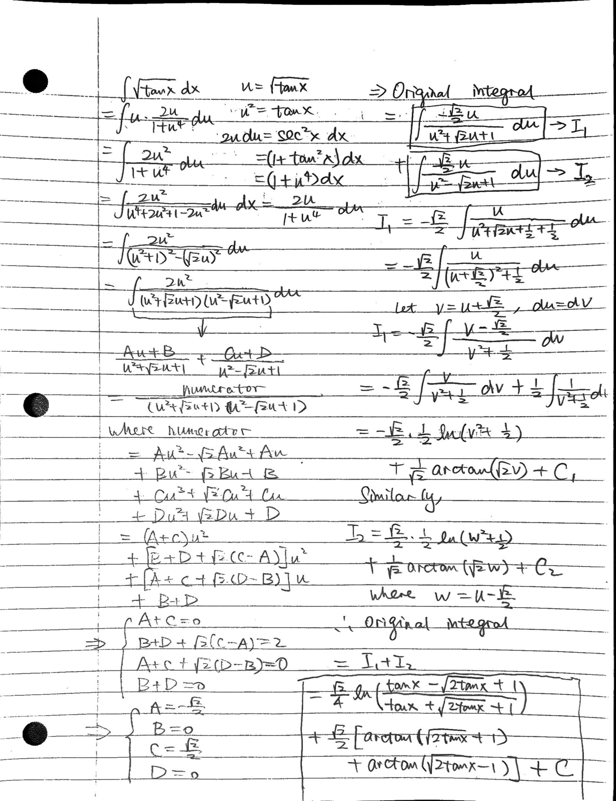

# An Interesting Integral

My Scioly teammates sent this meme in our Discord group chat:

{h=30em}

Here's my reply:

$$
\int\tan x\,dx = \frac{\sqrt{2}}{4}\ln\left(\frac{\tan x - \sqrt{2\tan x} + 1}{\tan x + \sqrt{2\tan x} + 1}\right) + \frac{\sqrt{2}}{2}\left[\arctan\left(\sqrt{2\tan x} + 1\right) + \arctan\left(\sqrt{2\tan x} - 1\right)\right] + C
$$

